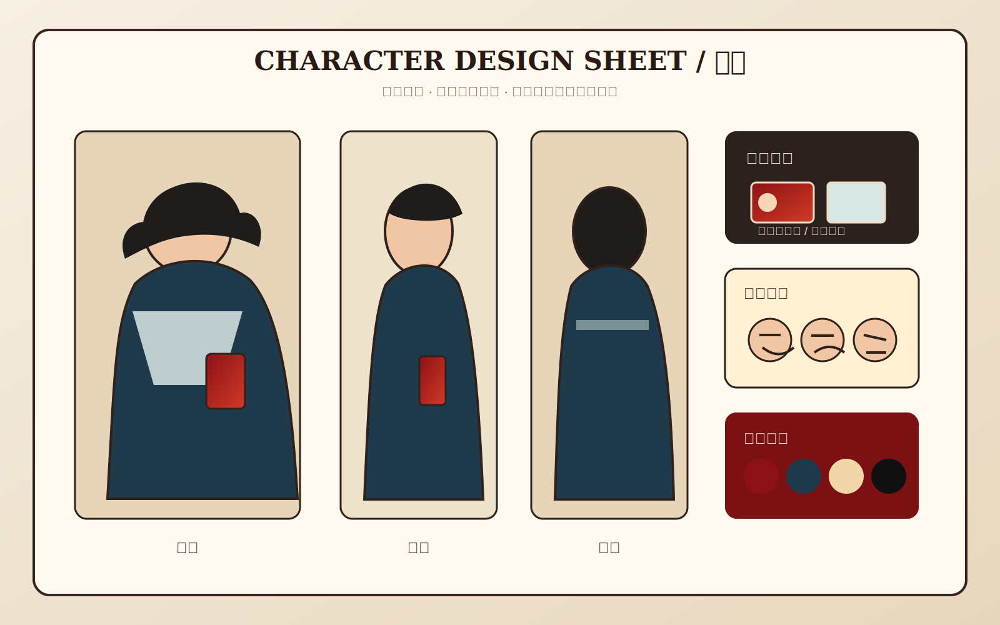
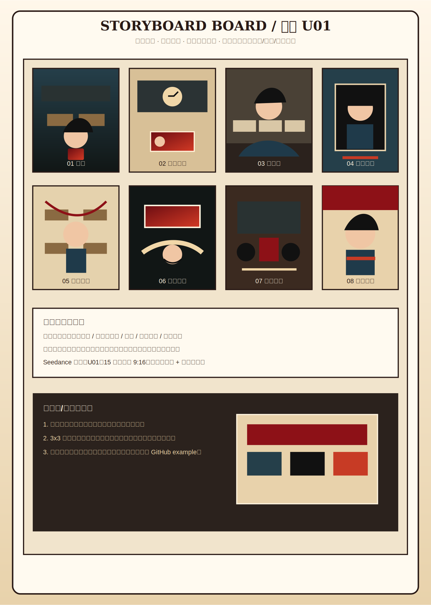

# 完整案例：灰铃

这是 `张艺谋Skill` 的完整图片案例，用来展示“剧本 + 流程清单 → 镜头表与单元切分 → 站位图 → 彩色分镜故事版/3x3 九宫格 → Seedance Prompt → 可选视频生成/自动剪辑”的输出形态。

题材：男主是一名学生，在校园异常循环中醒来，发现一张猩红学生卡成为秩序变化的证据。

## 图片资产预览

### 人物设定图



### 场景设定图


### 站位图


### 分镜故事版大图



### 严格 3x3 九宫格


## 这个案例展示什么

- 人物图、场景图、站位图、故事版和九宫格必须是图片资产，不是纯文字占位。
- 故事版可以带镜号、景别、动作和节奏说明。
- 3x3 视频参考图必须无字幕、无镜号、无水印、无说明文字，方便投给视频模型。
- 输出路径适配 Codex、Claude Code、OpenClaw、Hermes Desktop、Kimi、GLM、MiniMax 等 agent/model runtime。

## 建议目录

```text
gray-bell-campus/
├── README.md
├── images/
│   ├── character_linch_sheet.svg
│   ├── scene_old_classroom.svg
│   ├── blocking_u01.svg
│   ├── storyboard_sheet_01.svg
│   └── video_grid_u01_3x3.svg
├── docs/
├── storyboards/
├── video_grids/
├── adapters/
└── manifests/
```
